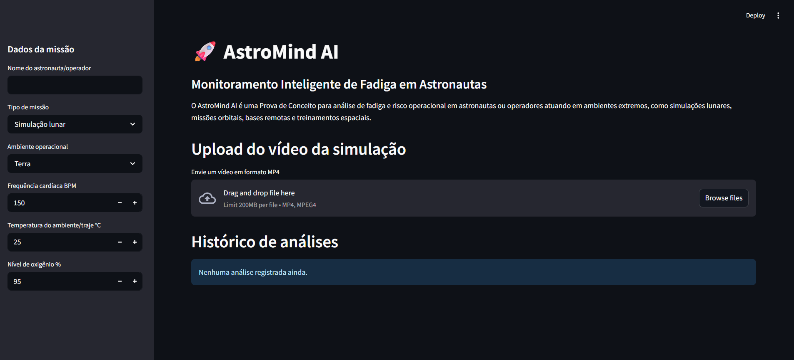
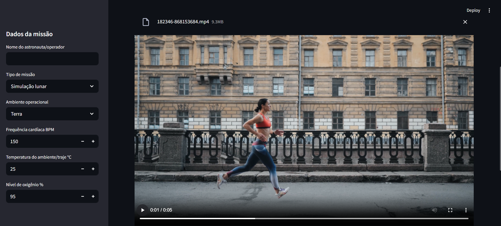
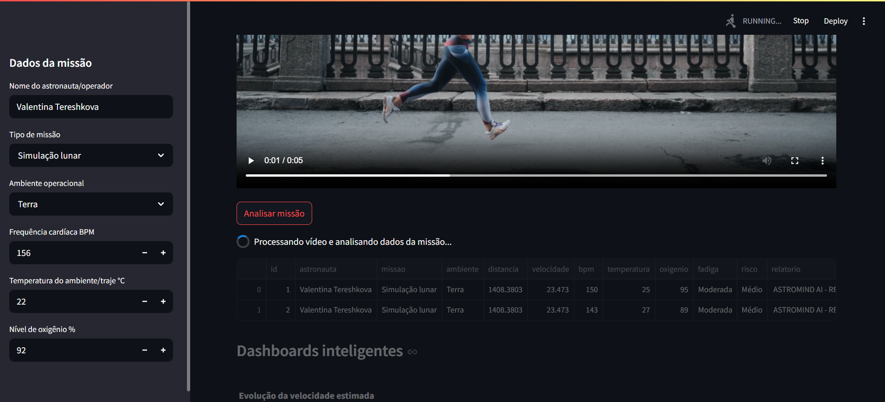
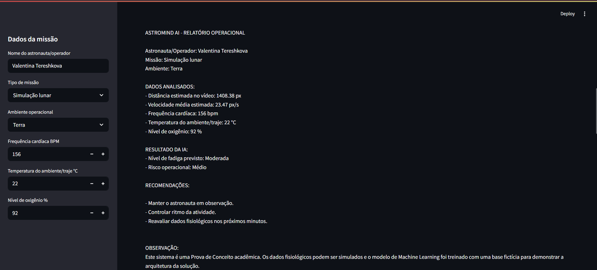
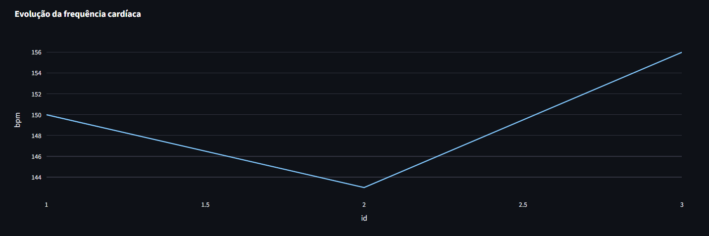
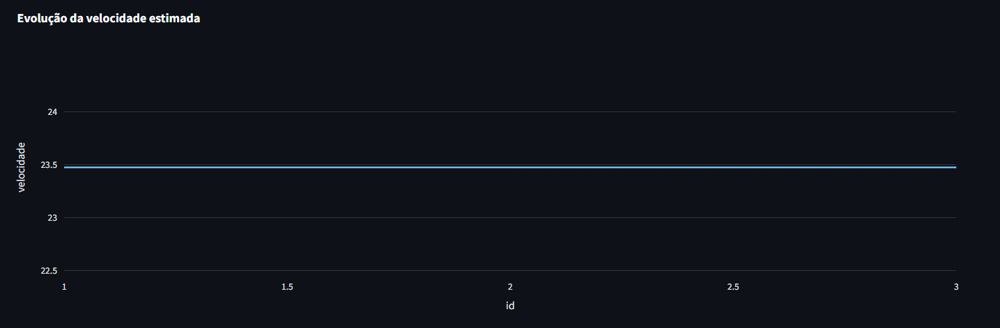
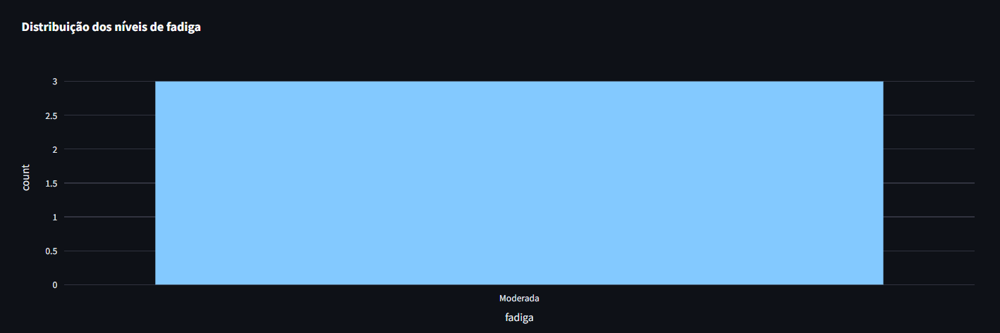

# FIAP - Faculdade de Informática e Administração Paulista

<p align="center">
<a href= "https://www.fiap.com.br/"></a>
</p>

<br>

# Nome do projeto
Fase 4 - Superando Limites: Era da Mobilidade e Visão Inteligente

## Nome do grupo
Grupo 65

## Integrantes: 
- <a href="https://www.linkedin.com/in/anacornachi/">Ana Cornachi</a>
- <a href="https://www.linkedin.com/in/carlamaximo/">Carla Máximo</a>

## Professores:
### Tutor(a) 
- <a href="https://www.linkedin.com/in/lucas-gomes-moreira-15a8452a/">Lucas Gomes Moreira</a>
### Coordenador(a)
- <a href="https://www.linkedin.com/in/andregodoichiovato/">André Godoi Chiovato</a>

---

# Descrição do Projeto (Global Solution 2026.1)

## Tema

Nova Economia Espacial

## Desafio

A crescente expansão da economia espacial exige o desenvolvimento de soluções inteligentes capazes de auxiliar no monitoramento de astronautas, operadores e equipes que atuam em ambientes extremos.

Durante missões espaciais, treinamentos orbitais, operações em bases remotas e simulações lunares, fatores como fadiga física, alterações fisiológicas e condições ambientais podem impactar diretamente a segurança da missão e o desempenho operacional.

O AstroPerformance AI foi desenvolvido como uma Prova de Conceito (POC) para demonstrar como técnicas de Inteligência Artificial, Machine Learning, Visão Computacional e análise de dados podem ser utilizadas para apoiar o monitoramento e a tomada de decisão em cenários espaciais.

---

# Objetivo da Solução

Desenvolver uma plataforma inteligente capaz de:

* Processar vídeos de movimentação de astronautas ou operadores;
* Analisar dados fisiológicos simulados;
* Estimar níveis de fadiga operacional;
* Classificar riscos operacionais;
* Gerar relatórios automáticos;
* Disponibilizar dashboards inteligentes para acompanhamento histórico.

---

# Tecnologias Utilizadas

## Inteligência Artificial

* Machine Learning
* Random Forest Classifier
* Classificação de fadiga

## Visão Computacional

* OpenCV
* Detecção de movimento
* Extração de deslocamento
* Estimativa de velocidade

## Análise de Dados

* Pandas
* NumPy

## Banco de Dados

* SQLite

## Dashboard

* Streamlit
* Plotly

## Linguagem

* Python 3

---

# Arquitetura da Solução

```text
Vídeo da simulação
+
Dados fisiológicos simulados (BPM, temperatura e oxigênio)

            ↓

      Streamlit

            ↓

        OpenCV

            ↓

 Detecção de Movimento

            ↓

 Cálculo de Distância e Velocidade Estimada

            ↓

 Random Forest

            ↓

 Predição de Fadiga

            ↓

 Cálculo de Risco Operacional

            ↓

 Relatório Automático

            ↓

 Banco SQLite

            ↓

 Dashboards Inteligentes
```

---

# ⚙ Funcionamento da Aplicação

## Entrada de Dados

O usuário informa:

* Nome do astronauta;
* Tipo da missão;
* Ambiente operacional;
* Frequência cardíaca (BPM);
* Temperatura do ambiente/traje;
* Nível de oxigênio.

Também é realizado o upload de um vídeo em formato MP4 contendo a movimentação do operador.

---

## Processamento do Vídeo

O OpenCV realiza:

* Conversão para escala de cinza;
* Aplicação de filtro Gaussiano;
* Detecção de bordas;
* Identificação de deslocamento médio entre frames.

A partir dessas informações são calculados:

* Distância estimada;
* Velocidade média estimada.

---

## Predição de Fadiga

O modelo Random Forest utiliza:

* Velocidade;
* Distância;
* BPM;
* Temperatura;
* Oxigênio.

Para classificar:

* Baixa
* Moderada
* Alta
* Crítica

---

## Avaliação de Risco Operacional

Com base na fadiga prevista e nos indicadores fisiológicos, o sistema determina:

* Baixo
* Médio
* Alto
* Crítico

---

## Relatório Inteligente

Após a análise, o sistema gera automaticamente um relatório contendo:

* Dados da missão;
* Indicadores calculados;
* Classificação de fadiga;
* Risco operacional;
* Recomendações para tomada de decisão.

---

# Dashboards

A plataforma disponibiliza:

### Evolução da Velocidade

Acompanhamento histórico da velocidade estimada.

### Evolução da Frequência Cardíaca

Monitoramento do BPM ao longo das análises.

### Distribuição de Fadiga

Visualização dos níveis de fadiga identificados.

### Distribuição de Riscos

Análise da frequência dos riscos operacionais.

---

# Estrutura do Projeto

```text
AstroPerformance AI/

├── README.md
├── requirements.txt

├── src/
│   ├── app.py
│   ├── database.py
│   ├── ml_model.py
│   ├── report_generator.py
│   └── video_analysis.py

└── data/
```

---

# 🔧 Como Executar o Projeto

## Instalar Dependências

```bash
pip install -r requirements.txt
```

## Executar Aplicação

```bash
streamlit run src/app.py
```

## Acessar

```text
http://localhost:8501
```

---

# Evidências

## Tela Inicial




## Upload de Vídeo



Inserir screenshot da seleção do vídeo.

## Processando Dados



## Resultado da Análise



## Dashboard 







---

# Aplicação no Contexto Espacial

Em um cenário real, o AstroPerformance AI poderia ser integrado a:

* sensores biométricos embarcados;
* smartwatches espaciais;
* sensores IoT em trajes espaciais;
* câmeras internas de módulos orbitais;
* bases lunares e marcianas;
* sistemas de suporte operacional de missões.

---

# 🔬 Limitações da POC

* Dados fisiológicos simulados;
* Base de treinamento fictícia;
* Distância calculada em pixels;
* Não utiliza sensores reais;
* Não substitui equipamentos médicos ou operacionais.

---

# 🗃 Histórico de Lançamentos

## 1.0.0 - Junho/2026

* Desenvolvimento da POC AstroPerformance AI;
* Implementação de Visão Computacional com OpenCV;
* Implementação de Machine Learning com Random Forest;
* Dashboard interativo com Streamlit e Plotly;
* Banco SQLite para armazenamento histórico;
* Geração automática de relatórios operacionais.

---

# 📋 Licença

Projeto acadêmico desenvolvido para a disciplina de Global Solution 2026.1 da FIAP.

Uso exclusivamente educacional.
